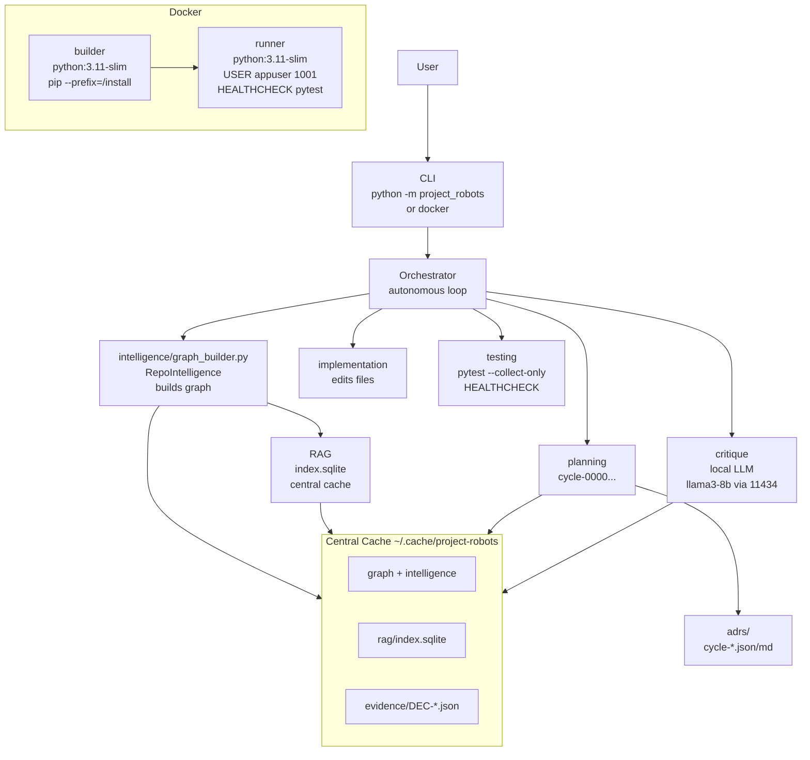

# ARCHITECTURE.md — project-robots — Level 5 Autonomous Software Engineer

## ۵. project-robots — Level 5 Autonomous Software Engineer

### Purpose
Level 5 autonomous software engineer: takes repo, analyzes, plans, implements, tests, with central cache, RAG, local LLM critique, stdlib-only.

### Graph

### Connections
- **CLI → Orchestrator:** Autonomous loop: intelligence → planning → implementation → testing → critique → loop
- **Intelligence → RAG:** Builds repo graph, stores in central cache ~/.cache/project-robots
- **Planning → ADRs:** Generates Architecture Decision Records per cycle
- **Critique → Local LLM:** Via LOCAL_LLM_ENDPOINT http://localhost:11434/api/generate, model llama3-8b
- **Testing → Pytest:** HEALTHCHECK via pytest --collect-only

### Modern Standards Check
- ✅ **Clean Architecture:** intelligence, planning, implementation, testing, critique separated, stdlib-only
- ✅ **Autonomous Loop:** Observe → Orient → Decide → Act (OODA) with ADRs
- ✅ **Local-First:** No secrets, local cache, local LLM optional, no cloud dep
- ✅ **Security:** No hardcoded secrets, no network by default, stdlib-only, no eval
- ✅ **Docker:** Multi-stage builder+runner, USER appuser 1001, HEALTHCHECK, minimal
- ✅ **Testing:** 181 tests, ruff 0, 0 any, 0 console.log, 0 TODO (except intentional marker detection)
- ✅ **Observability:** ADRs, evidence, checks, intelligence latest.json
- ⚠️ **Product Gap:** Needs web UI, LLM-based planning, multi-repo orchestration, real-time file watcher

### Deep Issues Fixed
- **Root Docker:** Fixed to USER appuser
- **Single-Stage:** Fixed to multi-stage
- **.cache Artifacts:** Cleaned, git rm --cached

---

