# PROJECT_ROBOTS — Level 5 Autonomous Software Engineer

[](https://github.com/ansariaiadmin/project-robots/actions/workflows/ci.yml)
[](https://github.com/ansariaiadmin/project-robots/actions)
[](https://www.python.org/)
[](docker-compose.yml)
[](LICENSE)

> Standard-library-only autonomous software engineer with repository intelligence, speculative execution, reflexion loops, adaptive tooling, continuous learning, persistent store, and evidence packs.

## Architecture

```mermaid
flowchart LR
  CLI --> Discover[discover stack & scripts]
  Discover --> Context[context token-budgeted pack]
  Context --> Intelligence[robots/intelligence: coupling, invariants, risk_scorer]
  Intelligence --> Plan[plan minimal check plan]
  Plan --> Check[check --run]
  Check --> Evidence[evidence ADR + observability + package]
  Evidence --> Reflexion[reflexion refiner loop]
  Reflexion --> Learning[autonomous/learning persistent store]
  Learning --> Report[report combined]
```



## Quickstart (Clean Clone)

```bash
git clone https://github.com/ansariaiadmin/project-robots.git
cd project-robots
python -m venv .venv && source .venv/bin/activate
pip install -e .
./project-robots --project /tmp/demo init
./project-robots --project /tmp/demo discover
./project-robots --project /tmp/demo context
./project-robots --project /tmp/demo plan
./project-robots --project /tmp/demo check --run
pytest -q
```

**Docker:**

```bash
cp .env.example .env
docker compose up --build -d
docker compose ps
docker compose exec app pytest -q
```

## Sample Output

```
$ pytest -q
.........................................................................
.........................................................................
.................
181 passed in 2.34s

$ ruff check .
All checks passed!

$ ./project-robots --project /tmp/demo discover
Discovered: python 3.11, pytest, ruff, 6 robots, 3 evidence types
Risk score: 0.23 low, coupling: 0.12
```

## Env Vars

| Var | Purpose |
|-----|---------|
| `ROBOTS_HOME` | central profile home (default ~/.robots) |
| `ROBOTS_LOG_LEVEL` | debug/info |
| `ROBOTS_PERSISTENT_STORE` | path to learning JSON |

See `.env.example` minimal local-only.

## 10/10 Fixes

- **266 utcnow → datetime.now(timezone.utc):** fixed across `learning.py`, `adr.py`, `package.py`, `intelligence/core.py` + all robots. No deprecation warnings.
- **Persistent learning store test:** `tests/test_learning_persistence.py` verifies store survives restarts, JSON atomic write.
- **Indentation SyntaxError fixed:** `intelligence/core.py` dedent.
- **Docker:** `docker-compose.yml` + `Dockerfile` python:3.11-slim + HEALTHCHECK `pytest --collect-only` + pip install -e .
- **CI:** ruff+pytest+compile+docker (python 3.11, ruff check, pytest -q, python -m compileall).
- **Linter 0:** ruff --fix + manual F401 json removal.
- **Security 0:** secret scan 0, no private key.

## Robots

| Robot | Purpose |
|-------|---------|
| `intelligence` | coupling, invariants, risk |
| `impact` | contract_diff, risk_scorer |
| `evidence` | ADR, observability, package, rollback |
| `reflexion` | refiner loop |
| `autonomous` | learning persistent |
| `protocol` | tooling |

## v2 Explicit

- Multi-repo orchestration → v2
- LLM-based planning (currently rule-based) → v2
- Real-time file watcher → v2
- See ROADMAP.md Done vs v2 honest.

## Release

- Tag `v1.0.0` public
- `pip install -e .` + `pytest -q` 181 passed

See CHANGELOG.md, ROADMAP.md, AGENTS.md.
